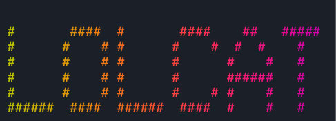

# react-lolcat 🌈

**react-lolcat** is a [React](https://react.dev) implementation of [lolcat](https://github.com/busyloop/lolcat) for the web.

If you don't know what lolcat is, it is a tool that provides a way to display rainbow-colorized text in your terminal. Something like this:

 😜

## Installation

Install the normal way. If you use npm, it may look like this.

```sh
npm install @rewdy/react-lolcat
```

(If you use yarn, pnpm, bun, etc. you obvs know what to do.)

---

## Usage

react-lolcat provides a `<Lolcat />` component and a `useLolcat()` hook. Both take a string of text and return a colorized `ReactNode`.

### Component example

This is how it may look to implement as a component:

```typescript
import { Lolcat } from "@rewdy/react-lolcat";

function Example() {
  return (
    {/*Note that you will probably want to wrap the output in a <pre /> tag.*/}
    <pre><Lolcat text="Hello, world!" /></pre>
  );
}
```

### Hook example

If for your usage, you prefer using a hook, we got chu. This is an example of how you would use with a hook:

```typescript
import { useLolcat } from "@rewdy/react-lolcat";

function Example() {
  const colorized = useLolcat("Oh... hello. ;)");
  // Again, note that you'll likely want to render this in a <pre /> tag.
  return <pre>{colorized}</pre>;
}
```

### Options

Both the component and the hook take a config prop to adjust the lolcat options. The config type looks like this:

```typescript
/**

* Lolcat Options
 */
export type LolcatOptions = {
  /**
  * Seed of the rainbow; use the same for the same pattern
   */
  seed?: number;
  /**
  * Spread of the rainbow
   */
  spread?: number;
  /**
  * Frequency of the rainbow colors
   */
  frequency?: number;
};
```

You can play with this config to fine-tune how your lolcats are displayed.

If you want to completely customize how the lolcats are rendered, you can do so by implementing the underlying colorizing function. The library exports `lolcatColorize()` that returns a matrix of rows of characters which are tuples of the character string and a `Color` object which has `red`, `green`, and `blue` values.

I'll let your figure it out from there. ✌️

---

## Final notes

* Major shout out to [lolcatjs](https://github.com/robertmarsal/lolcatjs) which is where the actual logic for colorizing the text has come from. (FYI, lolcatjs only works in your terminal, so that is why I made react-lolcat.)
* I made this for another little project you may like: [figlet browser](https://figlet-browser.rewdy.lol/). Figlet browser gives a nice way to find a figlet font to use.

Now, go make something cool 😎
